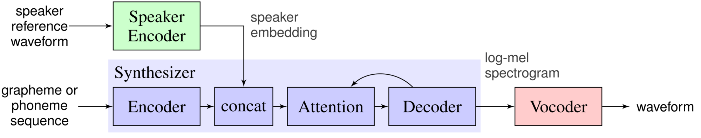

# Yoda text to speech
## Idea
The core idea behind the [article and google colab demo](https://broutonlab.com/blog/generate-Yoda-voice-by-your-text-in-5-minutes) we provide - is to exploring topic itself from moment of encoding sound to image with help of Fourier Transform to vocalize generated mel-spectrogram, explaining how Image style transfer can be applied to sound

#### examples of mel spectrograms

## Results
By running demo in the [article](https://broutonlab.com/blog/generate-Yoda-voice-by-your-text-in-5-minutes) you will be able to generate Yoda's voice and even your own

#### Example of Yoda voice generation:

## Resources
We used Real-Time-Voice-Cloning [repository](https://github.com/CorentinJ/Real-Time-Voice-Cloning) which which is an implementation of [Transfer Learning from Speaker Verification to Multispeaker Text-To-Speech Synthesis](https://arxiv.org/pdf/1806.04558.pdf) (SV2TTS) with a vocoder that works in real-time

#### sv2tts architecture

## Links
We plan to release a new [article about Nvidia Mellotron](https://broutonlab.com/blog/). 

Stay tuned to know latest resource breakthroughs as Mellotron is able to generate speech in a variety of styles ranging from read speech to expressive speech, from slow drawls to rap and from monotonous voice to singing voice
